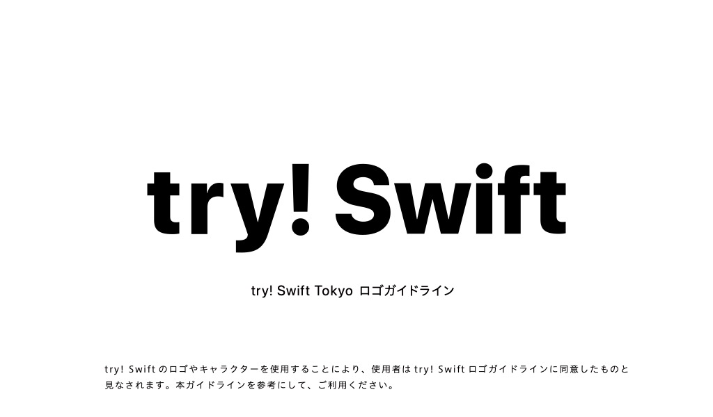

# try! Swift Tokyo logo guideline

try! Swift のロゴやキャラクターを使用することにより、使用者は try! Swift ロゴガイドラインに同意したものと見なされます。本ガイドラインを参考にして、ご利用ください。

The use of the try! Swift logo and characters indicates the user's agreement to the try! Swift logo guidelines. Please refer to this guideline for your use.

## ロゴの使用 / Use of the logo

- 改変せずロゴを使用してください。
- ファイル内の規定の色で使用してください。
- Please use the logo without modification.
- Use the logo in the specified colors in the file.

## Rikoの使用 / Use of Riko

- 改変せずキャラクターを使用してください。
- 色を変更しないでください。
- 要素を重ねないでください。
- 変形させないでください。

- Use the character without alteration.
- Do not change colors.
- Do not stack elements.
- Do not deform.

